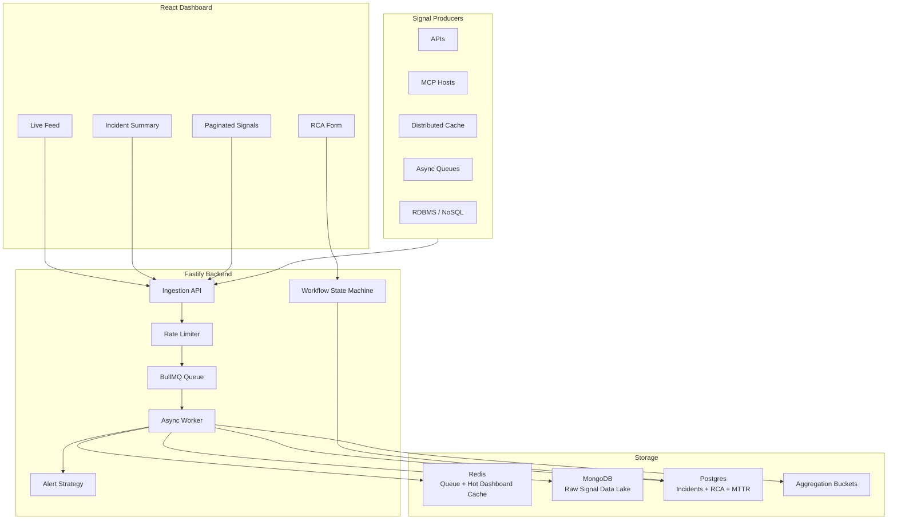

# Mission-Critical Incident Management System

This repository contains a Dockerized Incident Management System built for the Zeotap Infrastructure / SRE Intern assignment. The app ingests high-volume operational signals, groups noisy failures into incidents, stores raw evidence, supports RCA-driven closure, and exposes a responsive dashboard plus Swagger API documentation.

## Demo Video

[Screencast from 08-12-25 05:46:45 PM IST.webm](https://github.com/user-attachments/assets/7eea2b07-f708-4db6-8af0-f25d96e9778e)


## One-Command Setup

From a fresh clone:

```bash
docker compose up --build -d
```

Open:

- Frontend dashboard: `http://localhost:5173`
- Swagger UI: `http://localhost:4000/api-docs`
- Backend health: `http://localhost:4000/health`
- OpenAPI JSON: `http://localhost:4000/api-docs/json`

Seed sample incidents:

```bash
docker compose exec -T backend npm run simulate:failure
```

Stop the stack:

```bash
docker compose down
```

## What This System Does

The IMS monitors a distributed stack such as APIs, MCP hosts, caches, queues, RDBMS, and NoSQL stores.

It handles:

- high-volume signal ingestion,
- async processing and backpressure,
- incident debouncing,
- raw signal audit storage,
- transactional incident workflow,
- mandatory RCA before closure,
- MTTR calculation,
- live dashboard,
- Swagger-documented APIs.

## Architecture



## Runtime Services

Docker Compose starts five services:

| Service | Port | Purpose |
| --- | --- | --- |
| `frontend` | `5173` | React/Vite dashboard |
| `backend` | `4000` | Fastify API and BullMQ worker |
| `postgres` | `5432` | Source of truth for incidents and RCA |
| `mongo` | `27017` | Raw signal data lake |
| `redis` | `6379` | Queue, dashboard cache, backpressure path |

## Data Flow

1. A producer sends a signal to `POST /api/signals` or `POST /api/signals/batch`.
2. Fastify validates the payload and applies rate limiting.
3. The API enqueues the signal into BullMQ and returns `202 Accepted`.
4. The async worker consumes signals from Redis.
5. The worker writes raw payloads into MongoDB.
6. The worker upserts structured incidents into Postgres.
7. The worker updates Redis hot dashboard cache.
8. The React dashboard polls active incidents every 5 seconds.

## Backpressure Design

The ingestion endpoint never writes directly to Postgres or MongoDB. It only validates and enqueues.

```text
HTTP request -> validation -> rate limit -> Redis queue -> async worker -> databases
```

This protects the API when the persistence layer is slow. A burst increases queue depth instead of blocking all requests.

Implemented resilience:

- BullMQ queue between API and databases,
- bounded worker retry logic,
- BullMQ retry/backoff,
- configurable worker concurrency with `WORKER_CONCURRENCY`,
- Redis dashboard cache,
- raw signal pagination,
- health endpoint,
- throughput metrics every 5 seconds.

## Debouncing Logic

The worker creates a debounce key:

```text
componentId + 10-second-window
```

Example:

```text
100 signals for CACHE_CLUSTER_01 within 10 seconds
=> 1 incident work item
=> 100 raw signal records linked in MongoDB
```

Postgres enforces a unique debounce key, which makes concurrent workers converge on one incident per component/window.

## Workflow

Incident status flow:

```text
OPEN -> INVESTIGATING -> RESOLVED -> CLOSED
```

Rules:

- invalid transitions return `409 Conflict`,
- `RESOLVED -> CLOSED` requires a complete RCA,
- close without RCA returns `400 Bad Request`,
- MTTR is calculated when RCA is submitted.

RCA required fields:

- incident start,
- incident end,
- root cause category,
- fix applied,
- prevention steps.

## Design Patterns

### Alert Strategy Pattern

Alert strategy maps component type to severity and responder:

| Component | Severity | Responder |
| --- | --- | --- |
| `RDBMS` | `P0` | `database-oncall` |
| `MCP_HOST` | `P1` | `platform-oncall` |
| `CACHE` | `P2` | `cache-oncall` |
| `QUEUE` | `P1/P2` | `async-platform-oncall` |
| default | `P3` | `service-oncall` |

### State Pattern

Each workflow state validates what transition is allowed next. This keeps lifecycle rules in backend business logic instead of the UI.

## Live Feed

The live feed uses polling, not WebSocket.

- Frontend calls `GET /api/incidents` every 5 seconds.
- Backend returns active incidents from Redis hot cache.
- Manual refresh is also available.
- The refresh button shows a loading state while the request is running.

This is simple and reliable for the assignment. A production upgrade could replace polling with Server-Sent Events or WebSocket push.

## API Documentation

Swagger UI:

```text
http://localhost:4000/api-docs
```

Public API list:

```text
GET    /health
POST   /api/signals
POST   /api/signals/batch
GET    /api/incidents
GET    /api/incidents/:id
GET    /api/incidents/:id/signals?page=1&pageSize=25
PATCH  /api/incidents/:id/status
POST   /api/incidents/:id/rca
GET    /api/metrics/aggregations
```

## Demo Flow

Start the app:

```bash
docker compose up --build -d
```

Generate failures:

```bash
docker compose exec -T backend npm run simulate:failure
```

Open the dashboard:

```text
http://localhost:5173
```

Use the UI:

1. Select an incident from Live Feed.
2. Inspect incident summary.
3. Inspect paginated raw signals.
4. Move status to `INVESTIGATING`.
5. Move status to `RESOLVED`.
6. Fill the RCA form.
7. Submit RCA.
8. Close the incident.

## Useful Commands

```bash
docker compose ps
docker compose logs -f backend
docker compose logs -f frontend
docker compose exec -T backend npm run simulate:failure
docker compose exec -T backend npm run simulate:burst
npm test
npm run build
```

## Local Development Without Docker

Docker Compose is recommended for evaluation. For local development:

```bash
npm install
cd backend
cp .env.example .env
npx prisma db push
npm run dev
```

In another terminal:

```bash
cd frontend
npm run dev
```

You still need Postgres, MongoDB, and Redis running locally.

## Project Structure

```text
backend/
  prisma/schema.prisma
  src/alerting/          Alert Strategy Pattern
  src/workflow/          State Pattern
  src/ingestion/         BullMQ queue and worker
  src/incidents/         Incident and RCA service
  src/storage/           Prisma, Mongo, Redis clients
  scripts/               Failure simulators
  tests/                 Unit tests
frontend/
  src/main.tsx           React dashboard
  src/styles.css         Dashboard styling
docs/
  architecture.md
  implementation-guide.md
  prompts-and-plan.md
  submission-report.html
sample-data/
  failure-events.json
docker-compose.yml
```

## Testing

Run:

```bash
npm test
```

Current tests cover:

- RCA validation,
- blocked close without RCA,
- valid close with RCA,
- invalid state transitions,
- alert severity mapping.

## Build Verification

Run:

```bash
npm run build
docker compose down
docker compose up --build -d
docker compose ps
```

Expected exposed ports:

```text
backend   0.0.0.0:4000->4000
frontend  0.0.0.0:5173->5173
postgres  0.0.0.0:5432->5432
mongo     0.0.0.0:27017->27017
redis     0.0.0.0:6379->6379
```

## Non-Functional / Bonus Items

- One-command Docker Compose setup.
- Swagger/OpenAPI documentation.
- Queue-based backpressure.
- Rate limiting.
- Retry logic.
- Health endpoint.
- Throughput metrics.
- Redis hot dashboard cache.
- Paginated raw signal evidence.
- Docker build hygiene with `.dockerignore`.
- `.codex/` and `.agents/` ignored from Git.

## Troubleshooting

If the browser shows old UI after rebuild:

```text
Ctrl + Shift + R
```

If dependencies look stale:

```bash
docker compose down
docker compose up --build -d
```

If you want to reset all persisted data:

```bash
docker compose down -v
docker compose up --build -d
```
